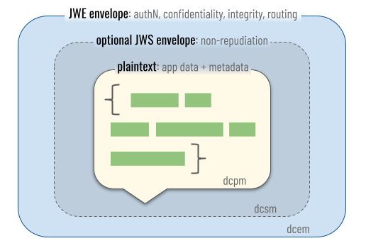

# Open Verifiable Trust Community (OpenVTC) with First Person Protocol

[](https://github.com/FirstPersonNetwork/openvtc-openvtc-rs)

A CLI tool for establishing verifiable trust relationships within developer
communities using Decentralised Identifiers (DIDs) and Verifiable Credentials
(VCs).

OpenVTC implements open standards and protocols to enable _"Know Your Developer"_
capabilities, following the [First Person Project white paper](https://www.firstperson.network/white-paper)
for establishing and verifying **first-person trust relationships** using
Personhood Credentials (PHCs) and Verifiable Relationship Credentials (VRCs).

## Table of Contents

- [Quickstart](#quickstart)
- [Core Concepts](#core-concepts)
- [Decentralised Identity](#decentralised-identity)
- [Decentralised Communication](#decentralised-communication)
- [Profiles and Configurations](#profiles-and-configurations)
  - [Public Configuration](#public-configuration)
  - [Private Configuration](#private-configuration)
  - [Secured Configuration](#secured-configuration)
- [Prerequisites](#prerequisites)
- [Feature Flags](#feature-flags)
- [Getting Started](#getting-started)
  - [Initial Setup](#initial-setup)
  - [Host Your DID Document](#host-your-did-document)
- [Check Setup Status](#check-setup-status)
- [Usage](#usage)
- [Additional Resources](#additional-resources)

## Quickstart

Install from source.

```bash
cargo install --path .
```

Run setup wizard.

```bash
openvtc setup
```

Check status.

```bash
openvtc status
```

View available commands.

```bash
openvtc --help
```

## Core Concepts

- **Decentralised Identifiers (DIDs)** - A globally unique identifier that enables secure digital interactions. The DID is the cornerstone of Self-Sovereign Identity (SSI), a concept that aims to put individuals or entities in control of their digital identities. DID is usually associated with a cryptographic key pair and represented with different DID methods, each with its own benefits.

- **Verifiable Credentials (VCs)** - A digital representation of a claim attested by a trusted issuer about the subject (e.g., Individual or Organisation). VC is cryptographically signed and verifiable using cryptographic keys associated with the DID of the issuer.

- **Personhood Credentials (PHCs)** – A type of verifiable credential issued by any ecosystem (any qualified entity such as a company, university, nonprofit community, government, etc.) that can attest to the credential holder being a real, unique person within that ecosystem. Part of PHC issuance is providing a verified identity verifiable credential issued by a trusted issuer. [Read more](https://docs.google.com/document/d/1RtS86BqyVn3i3mXm48VhC-SRaYvW2W_MvR4w6x9KQWY/edit?tab=t.0#heading=h.i544xd6ocqhm).

- **Verifiable Relationship Credentials (VRCs)** - A type of verifiable credential issued peer-to-peer between holders of personhood credentials to attest to verifiable first-person trust relationships. The verifiable relationship credential validates your personhood credential. [Read more](https://docs.google.com/document/d/1RtS86BqyVn3i3mXm48VhC-SRaYvW2W_MvR4w6x9KQWY/edit?tab=t.0#heading=h.siks62ntn9c5).

- **DIDComm Messaging Protocol** - An open standard for decentralised communication. Built on the foundation of Decentralised Identifiers (DIDs), it enables parties to exchange verifiable data such as credentials and establishes secure communication channels between parties without relying on centralised servers.

## Decentralised Identity

The OpenVTC tool uses the did:webvh to create your Persona DID. WebVH is a DID method that enhances the existing did:web method, introducing:

The OpenVTC tool uses the `did:webvh` to create your **Persona DID (P-DID)**. It enhances the existing `did:web` method, providing:

- Portability with a self-certifying identifier (SCID), allowing you to move to a different domain.

- Robust security by introducing a pre-rotation key and witness proof that approves changes to the DID.

- Robust security by introducing a pre-rotation key and witness proof that approves changes to the DID.

**Requirements:** A publicly accessible domain to host DID log entries (`did.jsonl`) for successful DID resolution and public key/service endpoint retrieval.

_Sample did:webvh identifier:_


## Decentralised Communication

OpenVTC seamlessly integrates with DIDComm-compatible mediators for secure, private communication using your **Persona DID (P-DID)** or **Relationship DID (R-DID)**.

DIDComm mediators handle message routing and storage while preserving privacy through end-to-end encryption. Messages are structured in multiple "envelope" layers providing:

- Confidentiality
- Sender authenticity
- Non-repudiation
- Sender anonymity

_Sample DIDComm message envelopes._



## Profiles and Configurations

OpenVTC supports multiple profiles, allowing you to represent different identities across various contexts.

To use a specific profile when running the tool, set the environment variable `OPENVTC_CONFIG_PROFILE` with the name of your profile. For example:

```bash
export OPENVTC_CONFIG_PROFILE=profile-1
```

> **Tip:** Add `OPENVTC_CONFIG_PROFILE` variable to ~/.zshrc or ~/.bashrc to persist across terminal sessions.

Each profile manages two types of configurations:

### Public Configuration

Stored in JSON format, the public configuration contains environment-specific details such as:

- Persona DID.
- Mediator DID.
- Security mode (e.g., Unlock Codes or Hardware Token).
- Encrypted private data containing known contacts, relationships, and VRCs.

Config file location:

- Default profile: `~/.config/openvtc/config.json`
- Named profiles: `~/.config/openvtc/config-<PROFILE_NAME>.json`

You can change the default location where the public configuration is saved by setting the environment variable `OPENVTC_CONFIG_PATH` with the new path. For example:

```bash
export OPENVTC_CONFIG_PATH=~/.config/openvtc-tool
```

> **Tip:** Add `OPENVTC_CONFIG_PATH` variable to ~/.zshrc or ~/.bashrc to persist across terminal sessions.

### Private Configuration

An encrypted configuration stored inside the public configuration file, containing sensitive information about:

- List of known contacts with their Persona DIDs and Alias.
- List of known relationships with their:
  - Remote and local Relationship DIDs (R-DIDs)
  - Remove and local Persona DIDs (P-DIDs)
  - Relationship aliases
- Verifiable Relationship Credentials (VRCs)

The private configuration uses the same encryption method as the [secured configuration](#secured-configuration).

### Secured Configuration

Sensitive information is stored in the operating system's secure storage, e.g., macOS Keychain or Linux Keyring.

The secured configuration includes:

- Private key materials.
- Encrypted Session Key (ESK), if using a hardware token.

For more details, refer to the [Secured Configuration Management](./docs/secured-configuration-management.md).

## Prerequisites

1. Rust version 1.88 or higher (Install [Rust](https://rust-lang.org/learn/get-started/))
2. Publicly accessible domain to host your DID document.
3. **Optional:** DIDComm mediator to send messages. OpenVTC provides a default DIDComm mediator.
4. **Optional:** Set environment variables.
   - `OPENVTC_CONFIG_PATH`: Path to openvtc configuration files (default:
     `~/.config/openvtc/config.json`).
   - `OPENVTC_CONFIG_PROFILE`: Set a specific configuration profile (defaults to `default`).

## Feature Flags

OpenVTC currently supports `openpgp-card` as an option to perform cryptographic operations, such as signing and authentication.

| Flag           | Description                               | Default |
| -------------- | ----------------------------------------- | ------- |
| `openpgp-card` | OpenPGP-compatible hardware token support | Enabled |

To turn off default features, use `--no-default-features` flag on the setup command.

```bash
openvtc --no-default-features setup
```

## Getting Started

### Initial Setup

1. Install locally from the source.

   ```bash
   cargo install --path .
   ```

   > **Note:** This will change once the tool is published.

2. Run the setup wizard.

   ```bash
   openvtc setup
   ```

   To set up a named profile instead of **default**, set the `-p/--profile` option.

   ```bash
   openvtc -p profile-1 setup
   ```

Follow the prompts to:

- Create the configuration.
- Generate cryptographic keys.
- Generate Persona DID.
- Connect to DIDComm mediator server.

### Host Your DID Document

After setup, OpenVTC generates a `did.jsonl` file for your Persona DID. The file must be hosted at a specific URL matching your configured DID.

The `did:webvh` method resolves your DID by fetching the DID document from a well-known location on the web. If the document is not hosted at the correct URL, the DID cannot be resolved or used.

**For example:**

- If your configured URL is `https://mydomain.com`, you must host the file at:

  ```
  https://mydomain.com/.well-known/did.jsonl
  ```

- If your configured URL is `https://mydomain.com/profile1`, you must host the file at:

  ```html
  https://mydomain.com/profile1/did.jsonl
  ```

> **Important:** The URL must be publicly accessible for DID resolution.

To set up multiple profiles for the same domain, see the [Multiple DIDs on Same Domain](./docs/multiple-didweb-same-domain.md).

## Check Setup Status

The OpenVTC configures your environment to ensure your setup is safe, secure, and private when running the tool.

To check the status or health of your current environment, run the following command.

```bash
openvtc status
```

If you wish to check the status for a specific profile, run the following the command.

```bash
openvtc -p profile-1 status
```

When successful, it displays the following info:

- Tool version.
- Your Persona DIDs, and whether your Persona DID is resolvable.
- Configured keys for authentication, encryption, and signing.
- List of requested and established relationships.
- DIDComm mediator connectivity.

## Usage

To run commands from installed binary:

```bash
openvtc status
```

To run commands from the source:

```bash
cargo run -- status
```

Refer to the complete [command reference](./docs/openvtc-tool-commands.md).

## Additional Resources

Additional resources to learn more about the Open Source Trust Community (OpenVTC) Tool.

- [First Person Project White Paper](https://www.firstperson.network/white-paper)
- [Relationships and VRCs Guide](./docs/relationships-vrcs.md)
- [Secure Key Management](./docs/secure-key-management.md)
- [Secured Configuration Management](./docs/secured-configuration-management.md)
- [Backup and Restore](./docs/backup-restore.md)
- [Multiple Profiles Setup](./docs/multiple-didweb-same-domain.md)
- [Config Data Structure](./docs/openvtc-config-data-structure.md)
