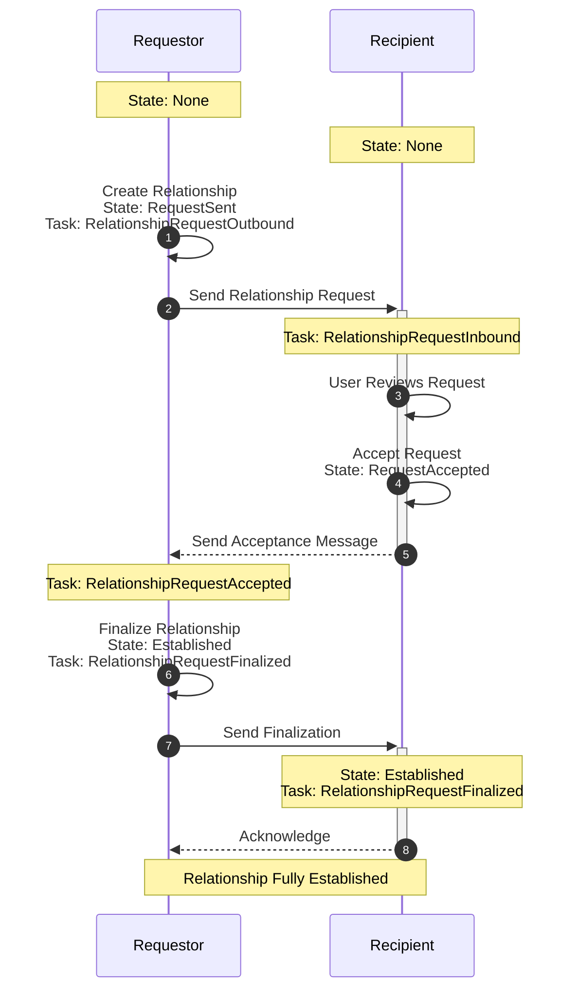
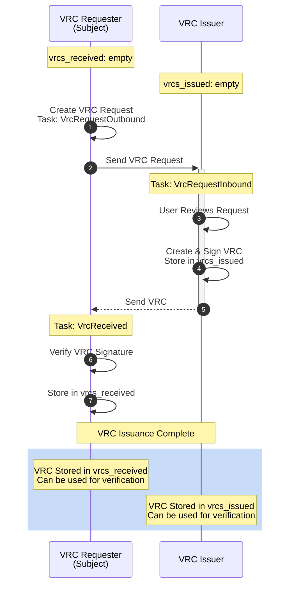

# OpenVTC Config Data Structure

The OpenVTC tool stores configuration data in three main categories:

1. **Public Config** - Contains publicly shareable configuration and
   metadata.
2. **Secured Config** - Contains BIP32 seed, cryptographic keys and
   key derivation information.
3. **Protected Config** - Contains private data like contacts,
   relationships, tasks, and VRCs.

<!-- omit from toc -->

## Table of Contents

- [Protection Modes](#protection-modes)
- [Config Storage Mapping](#config-storage-mapping)
- [Config Data Structure](#config-data-structure)
  - [1. Public Config (`PublicConfig`)](#1-public-config-publicconfig)
  - [2. Secured Config (`SecuredConfig`)](#2-secured-config-securedconfig)
  - [3. Protected Config (`ProtectedConfig`)](#3-protected-config-protectedconfig)
- [Data Flow and Workflows](#data-flow-and-workflows)
  - [Relationship Establishment Workflow](#relationship-establishment-workflow)
  - [VRC Request and Issuance Workflow](#vrc-request-and-issuance-workflow)
- [Logs Structure](#logs-structure)
- [Security Considerations](#security-considerations)
- [Thread Safety](#thread-safety)
- [State Consistency](#state-consistency)

## Protection Modes

The tool supports three protection modes for securing data:

- **Encrypted** - Protects the `SecuredConfig` with an unlock
  code/passphrase.
- **Plaintext** - Stores `SecuredConfig` in plaintext without
  encryption (not recommended for production use).
- **Token** - Protects `SecuredConfig` with an encrypted session
  key (ESK) using a hardware token (e.g., OpenPGP card).

See the
[Handling Secured Configuration](./secured-configuration-management.md)
documentation for more details.

## Config Storage Mapping

The OpenVTC tool manages configuration data across three storage types:

| Storage Type        | Content                                                                   | Storage Location                                         | Encryption                             |
| ------------------- | ------------------------------------------------------------------------- | -------------------------------------------------------- | -------------------------------------- |
| **PublicConfig**    | Metadata, DIDs, friendly names, logs, reference to encrypted private data | `~/.config/openvtc/config.json` (or `config-{profile}.json`) | Private field only                     |
| **SecuredConfig**   | BIP32 seed, key derivation info, cryptographic materials                  | OS secure storage (keyring/keychain)                     | Based on protection mode               |
| **ProtectedConfig** | Contacts, relationships, tasks, VRCs                                      | Encrypted inside `PublicConfig.private` field            | Always encrypted with `m/1'/0'/0'` key |

**Loading Configuration:**

When calling the OpenVTC tool commands, it loads the three
configurations and combines them into a single `Config` struct that
the application uses to complete a request.

When saving the configuration:

1. **PublicConfig** is serialized to JSON and saved to disk.
2. **SecuredConfig** is saved to the OS secure storage. It is
   encrypted depending on the selected protection mode.
3. **ProtectedConfig** is encrypted with the key derived from
   `m/1'/0'/0'` path and stored in the `private` field of
   `PublicConfig`.

See
[Profiles and Configurations](../README.md#profiles-and-configurations)
for configuration file locations and environment variables.

## Config Data Structure

### 1. Public Config (`PublicConfig`)

The public configuration contains metadata and publicly shareable
information about the persona.

| Field           | Type                   | Description                                                                                                                                    |
| --------------- | ---------------------- | ---------------------------------------------------------------------------------------------------------------------------------------------- |
| `protection`    | `ConfigProtectionType` | Indicates the security method used (Encrypted, Plaintext, or Token with hardware ID).                                                          |
| `persona_did`   | `String`               | Decentralised identifier for the persona (using `did:webvh` method).                                                                           |
| `mediator_did`  | `String`               | DID of the mediator service used for message routing. See [Decentralised Communication](../README.md#decentralised-communication) for details. |
| `friendly_name` | `String`               | User-friendly name for the profile (e.g., "Jane Doe").                                                                                         |
| `lk_did`        | `String`               | Linux Organisation DID representing the organizational identity within the OpenVTC ecosystem.                                                      |
| `logs`          | `Logs`                 | Contains log messages with timestamps and types.                                                                                               |
| `private`       | `Option<String>`       | Encrypted string reference to the private configuration.                                                                                       |

### 2. Secured Config (`SecuredConfig`)

The secured configuration contains sensitive cryptographic materials
and key information.

| Field               | Type                             | Description                                   |
| ------------------- | -------------------------------- | --------------------------------------------- |
| `bip32_seed`        | `String`                         | Base64-encoded BIP32 seed for key derivation. |
| `key_info`          | `HashMap<String, KeyInfoConfig>` | Map of key ID to key information.             |
| `protection_method` | `ProtectionMethod`               | Method used to protect the secured config.    |

#### Key Info Configuration (`KeyInfoConfig`)

| Field         | Type                | Description                                                                          |
| ------------- | ------------------- | ------------------------------------------------------------------------------------ |
| `path`        | `KeySourceMaterial` | Derivation path information (BIP32 derivation path, e.g., "m/1'/0'/0'") or imported. |
| `create_time` | `DateTime<Utc>`     | When the key was created.                                                            |
| `purpose`     | `KeyTypes`          | Purpose of the key (PersonaSigning, PersonaAuthentication, or PersonaEncryption).    |

#### Key Types (`KeyTypes`)

| Purpose                 | Key Number | Derivation Path | Description                      |
| ----------------------- | ---------- | --------------- | -------------------------------- |
| `PersonaSigning`        | key-1      | `m/1'/0'/0'`    | Key used for signing operations. |
| `PersonaAuthentication` | key-2      | `m/1'/0'/1'`    | Key used for authentication.     |
| `PersonaEncryption`     | key-3      | `m/1'/0'/2'`    | Key used for encryption.         |

The key IDs follow the pattern: `{persona_did}#key-{number}`.

For more information, see the
[Secure Key Management](./secure-key-management.md) documentation.

### 3. Protected Config (`ProtectedConfig`)

The protected configuration contains private and personal
information stored inside the `PublicConfig.private` field. The `ProtectedConfig` is always encrypted using a
cryptographic key derived from the `m/1'/0'/0'` derivation path.

| Field           | Type            | Description                                   |
| --------------- | --------------- | --------------------------------------------- |
| `contacts`      | `Contacts`      | Contact information and aliases.              |
| `relationships` | `Relationships` | Relationship management data.                 |
| `tasks`         | `Tasks`         | Task management data.                         |
| `vrcs_issued`   | `Vrcs`          | Verifiable relationship credentials issued.   |
| `vrcs_received` | `Vrcs`          | Verifiable relationship credentials received. |

#### Protected Config Categories

##### Contacts (`Contacts`)

Manages contact information and aliases for known DIDs. Contacts
are typically populated when establishing a relationship.

| Field      | Type                               | Description                                                                                    |
| ---------- | ---------------------------------- | ---------------------------------------------------------------------------------------------- |
| `contacts` | `HashMap<Arc<String>, Arc<Contact>>` | Maps a DID string to the full Contact structure.                                               |
| `aliases`  | `HashMap<String, Arc<Contact>>`     | Maps a human-readable alias (e.g., "John Doe") to the same Contact structure for quick lookup. |

Both maps reference the same Contact data, allowing lookups by DID or alias.

**Contact Structure:**

| Field   | Type             | Description                             |
| ------- | ---------------- | --------------------------------------- |
| `did`   | `Arc<String>`     | The DID of the contact.                 |
| `alias` | `Option<String>` | Optional friendly name for the contact. |

**Example:**

```rust
contacts: {
    "did:webvh:QmTU9qKozdkmRLMFacKGx65ze256ahWgVknHCUkdZJhMmc:yourdomain.com": Contact {
        did: "did:webvh:QmTU9qKozdkmRLMFacKGx65ze256ahWgVknHCUkdZJhMmc:yourdomain.com",
        alias: Some("John Doe"),
    },
},
aliases: {
    "John Doe": Contact {
        did: "did:webvh:QmTU9qKozdkmRLMFacKGx65ze256ahWgVknHCUkdZJhMmc:yourdomain.com",
        alias: Some("John Doe"),
    },
},
```

##### Relationships (`Relationships`)

Manages peer-to-peer relationships between personas.

| Field           | Type                                           | Description                                                                                                                                        |
| --------------- | ---------------------------------------------- | -------------------------------------------------------------------------------------------------------------------------------------------------- |
| `relationships` | `HashMap<Arc<String>, Arc<Mutex<Relationship>>>` | Map of remote DID to relationship.                                                                                                                 |
| `path_pointer`  | `u32`                                          | Tracks the next available BIP32 derivation index for relationship-specific keys. Increments with each new relationship to ensure unique key paths. |

**Relationship Structure:**

| Field          | Type                | Description                                    |
| -------------- | ------------------- | ---------------------------------------------- |
| `task_id`      | `Arc<String>`        | ID of the task that created this relationship. |
| `our_did`      | `Arc<String>`        | Our DID used in this relationship.             |
| `remote_did`   | `Arc<String>`        | The remote party's DID.                        |
| `remote_p_did` | `Arc<String>`        | The remote party's persona DID.                |
| `created`      | `DateTime<Utc>`     | When the relationship was created.             |
| `state`        | `RelationshipState` | Current state of the relationship.             |

**Relationship States (`RelationshipState`):**

| State             | Description                                  |
| ----------------- | -------------------------------------------- |
| `RequestSent`     | Relationship request sent to the respondent. |
| `RequestAccepted` | Request was accepted by the recipient.       |
| `Established`     | Relationship is fully established.           |
| `RequestRejected` | Request was rejected.                        |
| `None`            | No established relationship.                 |

Relationships track the full lifecycle from request to establishment.

**Example:**

```rust
relationships: {
    "did:webvh:QmTU9qKozdkmRLMFacKGx65ze256ahWgVknHCUkdZJhMmc:yourdomain.com": Mutex {
        data: Relationship {
            task_id: "5be058b3-2e5a-45dd-ba71-1a79aa0b97d2",
            our_did: "did:webvh:QmbwpJ8u62j5LSPiV17iycuK2kDQihVC2Cs49HVxq9KpNW:yourdomain.com",
            remote_did: "did:webvh:QmTU9qKozdkmRLMFacKGx65ze256ahWgVknHCUkdZJhMmc:yourdomain.com",
            remote_p_did: "did:webvh:QmTU9qKozdkmRLMFacKGx65ze256ahWgVknHCUkdZJhMmc:yourdomain.com",
            created: 2026-01-12T06:05:00.361845Z,
            state: RequestSent,
        },
        poisoned: false,
        ..
    },
},
```

##### Tasks (`Tasks`)

Manages pending and completed tasks for the persona. Tasks
represent actionable items or notifications requiring user
interaction.

**Tasks Structure:**

| Field   | Type                                   | Description                     |
| ------- | -------------------------------------- | ------------------------------- |
| `tasks` | `HashMap<Arc<String>, Arc<Mutex<Task>>>` | Map of task ID to task details. |

**Task Structure:**

| Field     | Type            | Description                    |
| --------- | --------------- | ------------------------------ |
| `id`      | `Arc<String>`    | Unique task identifier (UUID). |
| `type_`   | `TaskType`      | Type and details of the task.  |
| `created` | `DateTime<Utc>` | When the task was created.     |

**Task Types (`TaskType`):**

| Type                                                           | Description                                               |
| -------------------------------------------------------------- | --------------------------------------------------------- |
| `RelationshipRequestOutbound { to: Arc<String> }`               | Outgoing relationship request sent to remote party.       |
| `RelationshipRequestInbound`                                   | Incoming relationship request received from remote party. |
| `RelationshipRequestAccepted`                                  | Relationship request was accepted by the recipient.       |
| `RelationshipRequestRejected`                                  | Relationship request was rejected by the recipient.       |
| `RelationshipRequestFinalized`                                 | Relationship fully established between both parties.      |
| `VRCRequestOutbound { relationship: Arc<Mutex<Relationship>> }` | Outgoing VRC request sent to credential issuer.           |
| `VRCRequestInbound`                                            | Incoming VRC request received from credential requester.  |
| `VRCRequestRejected`                                           | VRC request was rejected by the issuer.                   |
| `VRCIssued`                                                    | VRC was issued to requester.                              |

**Example:**

```rust
tasks: {
    "5be058b3-2e5a-45dd-ba71-1a79aa0b97d2": Mutex {
        data: Task {
            id: "5be058b3-2e5a-45dd-ba71-1a79aa0b97d2",
            type_: RelationshipRequestOutbound {
                to: "did:webvh:QmTU9qKozdkmRLMFacKGx65ze256ahWgVknHCUkdZJhMmc:yourdomain.com",
            },
            created: 2026-01-12T06:05:00.361858Z,
        },
        poisoned: false,
        ..
    },
},
```

##### VRCs (Verifiable Relationship Credentials)

Stores issued and received verifiable credentials. VRCs are
tracked in **vrcs_issued** (credentials you have issued to others)
and **vrcs_received** (credentials you have received from others).

| Field  | Type                                                          | Description                                                    |
| ------ | ------------------------------------------------------------- | -------------------------------------------------------------- |
| `vrcs` | `HashMap<Arc<String>, HashMap<Arc<String>, Arc<DTGCredential>>>` | Map of remote P-DID to VRC credentials (nested map by VRC ID). |

**VRC Structure:**

| Field        | Type                    | Description                              |
| ------------ | ----------------------- | ---------------------------------------- |
| `id`         | `String`                | Unique credential identifier.            |
| `credential` | `String`                | The credential data (JSON or JWT).       |
| `issuer`     | `String`                | DID of the credential issuer.            |
| `subject`    | `String`                | DID of the credential subject.           |
| `issued_at`  | `DateTime<Utc>`         | When the credential was issued.          |
| `expires_at` | `Option<DateTime<Utc>>` | Optional expiration time.                |
| `revoked`    | `bool`                  | Whether the credential has been revoked. |

**Example:**

```rust
vrcs_issued: Vrcs {
    vrcs: {},  // Empty in this example
},
vrcs_received: Vrcs {
    vrcs: {},  // Empty in this example
},
```

## Data Flow and Workflows

### Relationship Establishment Workflow

The relationship establishment process involves multiple state transitions,
which are tracked in both relationships and tasks. The workflow differs
depending on whether you are initiating (Requestor) or receiving (Recipient)
the relationship request.

#### Requestor Side (Outbound Request)

The party initiating the relationship request goes through these states:

| Step | Action                    | Relationship State | Task Type                                          | Description                                                                                   |
| ---- | ------------------------- | ------------------ | -------------------------------------------------- | --------------------------------------------------------------------------------------------- |
| 1    | Send relationship request | `RequestSent`      | `RelationshipRequestOutbound { to: "remote_did" }` | Initial request is sent to the remote party. A task is created to track the outbound request. |
| 2    | Receive acceptance        | `RequestSent`      | `RelationshipRequestAccepted`                      | Remote party accepts the request. A new task is fetched indicating acceptance.                |
| 3    | Finalize relationship     | `Established`      | `RelationshipRequestFinalized`                     | Relationship is confirmed and fully established. Task indicates finalization.                 |

**State Transitions:**

- `RequestSent` → `Established` (when acceptance is received and finalized)

#### Recipient Side (Inbound Request)

The party receiving the relationship request goes through these states:

| Step | Action                       | Relationship State    | Task Type                      | Description                                                                               |
| ---- | ---------------------------- | --------------------- | ------------------------------ | ----------------------------------------------------------------------------------------- |
| 1    | Receive relationship request | N/A (not yet created) | `RelationshipRequestInbound`   | Incoming request is received. A task is created for user to review and act upon.          |
| 2    | Accept request               | `RequestAccepted`     | N/A                            | User accepts the request. Relationship is created with `RequestAccepted` state.           |
| 3    | Relationship established     | `Established`         | `RelationshipRequestFinalized` | Requestor finalizes, relationship becomes fully established. Task indicates finalization. |

**State Transitions:**

- No relationship → `RequestAccepted` (when user accepts inbound request)
- `RequestAccepted` → `Established` (when requestor finalizes)

#### Relationship Workflow Sequence

The end-to-end workflow to establish a relationship between two personas:



#### Relationship Workflow Key Points

- **Asynchronous Process**: The workflow involves message exchanges
  that may not be instantaneous.
- **Task-Driven**: Each state change is accompanied by task
  creation/updates that drive user interactions.
- **Bi-directional Communication**: Both parties must confirm the
  relationship for it to reach `Established` state.
- **Log Tracking**: Each significant action generates log entries
  for audit purposes.

See the
[Establishing Relationship](./relationships-vrcs.md#establish-relationship)
documentation for more details.

### VRC Request and Issuance Workflow

The VRC (Verifiable Relationship Credential) request and issuance
process involves interaction between two personas: a credential
requester (subject) and a credential issuer.

The workflow is tracked through tasks and stored VRCs.

#### Requester Side (VRC Request)

The persona requesting a verifiable relationship credential goes through
the following steps:

| Step | Action                  | VRC Storage     | Task Type            | Description                                                                                                |
| ---- | ----------------------- | --------------- | -------------------- | ---------------------------------------------------------------------------------------------------------- |
| 1    | Request VRC from issuer | N/A             | `VrcRequestOutbound` | Requester sends a credential request to the issuer. Task tracks the outbound request.                      |
| 2    | Receive VRC             | `vrcs_received` | `VrcReceived`        | Issuer issues the credential. The VRC is verified and stored in `vrcs_received`. A task indicates receipt. |
| 3    | Verify and store VRC    | `vrcs_received` | N/A                  | The VRC is verified and stored for future use.                                                             |

#### Issuer Side (VRC Issuance)

The persona issuing a verifiable relationship credential goes through
the following steps:

| Step | Action                | VRC Storage   | Task Type           | Description                                                                        |
| ---- | --------------------- | ------------- | ------------------- | ---------------------------------------------------------------------------------- |
| 1    | Receive VRC request   | N/A           | `VrcRequestInbound` | Incoming credential request is received. A task is created for the user to review. |
| 2    | Issue VRC             | `vrcs_issued` | N/A                 | User approves and issues the credential. The VRC is stored in `vrcs_issued`.       |
| 3    | Send VRC to requester | `vrcs_issued` | N/A                 | The issued VRC is sent to the requester.                                           |

#### VRC Workflow Sequence

The end-to-end workflow for VRC request and issuance:



#### VRC Workflow Key Points

- **Separate Storage**: Issued and received VRCs are stored separately
  (`vrcs_issued` vs `vrcs_received`).
- **Cryptographic Verification**: VRCs are cryptographically signed by the
  issuer and verified by the recipient.
- **Expiration Tracking**: VRCs can have optional expiration times for
  time-limited credentials.
- **Task-Driven**: Both request and receipt are tracked through tasks
  requiring user interaction.
- **Audit Trail**: Key VRC events are logged for audit purposes.

See the [Requesting Verifiable Relationship Credential](./relationships-vrcs.md#request-verifiable-relationship-credential-vrc)
documentation for more details.

## Logs Structure

Logs track key events in the OpenVTC tool from initial setup to establishing
relationships and receiving VRCs. New messages are appended, and old messages
are retained up to the configured limit.

**Logs Structure:**

| Field      | Type                   | Description                                |
| ---------- | ---------------------- | ------------------------------------------ |
| `messages` | `VecDeque<LogMessage>` | Double-ended queue of log messages.        |
| `limit`    | `usize`                | Maximum number of log entries (e.g., 100). |

**LogMessage Structure:**

| Field     | Type            | Description                                                                   |
| --------- | --------------- | ----------------------------------------------------------------------------- |
| `created` | `DateTime<Utc>` | Timestamp when the log entry was created (e.g., 2026-01-12T05:45:19.989808Z). |
| `type_`   | `LogFamily`     | Type of log event (Config, Contact, Relationship, Task).                      |
| `message` | `String`        | Log message content.                                                          |

**Log Types (`LogFamily`):**

| Type           | Description                    |
| -------------- | ------------------------------ |
| `Config`       | Configuration-related events.  |
| `Contact`      | Contact management events.     |
| `Relationship` | Relationship lifecycle events. |
| `Task`         | Task creation and updates.     |

**Log Examples:**

- **Config**: "Initial openvtc setup completed"
- **Contact**: "Added contact (did:webvh:...openvtc) alias(John Doe)"
- **Relationship**: "Relationship requested: remote
  DID(did:webvh:...openvtc) Task ID(5be058b3-...)"
- **Task**: "Fetched: Task ID(5be058b3-...) Type(Relationship
  Request (Inbound)) From(did:webvh:...openvtc)"

From a complete relationship establishment:

```rust
logs: Logs {
    messages: [
        // Initial setup
        LogMessage {
            created: 2026-01-12T05:45:19.989808Z,
            type_: Config,
            message: "Initial openvtc setup completed",
        },
        // Contact added
        LogMessage {
            created: 2026-01-12T06:05:00.345729Z,
            type_: Contact,
            message: "Added contact (did:webvh:...openvtc) alias(John Doe)",
        },
        // Relationship requested
        LogMessage {
            created: 2026-01-12T06:05:00.361997Z,
            type_: Relationship,
            message: "Relationship requested: remote DID(...openvtc) Task ID(5be058b3-...)",
        },
        // Request finalized
        LogMessage {
            created: 2026-01-12T06:06:08.646416Z,
            type_: Relationship,
            message: "Relationship request finalized: remote DID(...openvtc) Task ID(5be058b3-...)",
        },
        // Task fetched
        LogMessage {
            created: 2026-01-12T06:06:08.646429Z,
            type_: Task,
            message: "Fetched: Task ID(5be058b3-...)
                Type(Relationship Request Accepted) From(...openvtc)",
        },
    ],
    limit: 100,
}
```

## Security Considerations

1. **BIP32 Seed**: The BIP32 seed is the master secret from which all keys
   are derived. It must be protected and stored in a secure place that only
   you have access to.

2. **Protected Config Encryption**: The `private` field in `PublicConfig`
   contains an encrypted reference to the `ProtectedConfig` data. Regardless
   of the protection method selected, `ProtectedConfig` is always encrypted
   with the key derived from the `m/1'/0'/0'` path.

## Thread Safety

The OpenVTC tool uses `Mutex<T>` wrappers for mutable shared data, such as
Relationships and Tasks. This ensures data is protected during concurrent
operations or interactions with the OpenVTC tool.

The `poisoned` flag indicates whether a Mutex panicked while locked.
In normal operation, this should always be `false`.

## State Consistency

The OpenVTC tool maintains consistency between related data structures, for example:

- When a relationship is created, corresponding tasks are created.
- When a contact is added, logs are updated.
- Relationship states align with task states throughout the workflow.
