# Relationships and VRCs

The OpenVTC tool enables you to establish relationships with other DIDs (e.g., peers, coworkers, or community members) and communicate privately through the DIDComm protocol using your **Persona DID (P-DID)** or **Relationship DID (R-DID)**.

Once a relationship is established, you can request a **Verifiable Relationship Credential (VRC)**, a peer-to-peer credential that attests to verifiable trust relationships between personhood credential holders.

_The diagram below illustrates the typical flow of establishing a relationship and requesting a VRC. An R-DID is generated to enable private channel communication between parties._

```mermaid
sequenceDiagram
    autonumber
    box transparent Establish Relationship
    actor req as Requestor (P-DID)
    actor res as Respondent (P-DID)
    end

    req->>res: Send Relationship Request
    Note over req, res: Requestor generates R-DID and<br/>sets Respondent's alias
    res->>req: Accept Relationship Request
    Note over res, req: Respondent generates R-DID and<br/>sets Requestor's alias
    req->>res: Finalize Relationship Request
    Note over req, res: Updates status to "Established"

    create actor rdid-req as Requestor (R-DID)
    req->>rdid-req: Switch to VRC flow
    Note over req, rdid-req:  Actors uses R-DID for private channel communication
    create actor rdid-res as Respondent (R-DID)

    rdid-req->>rdid-res: Request VRC
    rdid-res->>rdid-req: Issue VRC
```



## Table of Contents

- [Establish Relationship](#establish-relationship)
  - [1. Send Relationship Request (Requestor)](#1-send-relationship-request-requestor)
  - [2. Accept Relationship Request (Respondent)](#2-accept-relationship-request-respondent)
  - [3. Finalise Relationship Request](#3-finalise-relationship-request)
- [Request Verifiable Relationship Credential (VRC)](#request-verifiable-relationship-credential-vrc)
  - [Prerequisite](#prerequisite)
  - [1. Request VRC Issuance (Requestor)](#1-request-vrc-issuance-requestor)
  - [2. Generate and Issue VRC (Respondent)](#2-generate-and-issue-vrc-respondent)
  - [3. Claim and Store VRC (Requestor)](#3-claim-and-store-vrc-requestor)
- [List and View VRCs](#list-and-view-vrcs)

## Establish Relationship

Follow these steps to establish a relationship with another Persona DID.

### 1. Send Relationship Request (Requestor)

Send a relationship request to another DID:

```bash
openvtc relationships request --respondent <Persona_DID> --alias <Respondent_Alias>
```

This command sends a relationship request and sets an alias for the relationship.

**Optional:** Generate a local Relationship DID (R-DID) for private communication:

```bash
openvtc relationships request --respondent <Persona_DID> --alias <Respondent_Alias> --generate-did
```

When an R-DID is present, subsequent communication uses the R-DID for privacy; otherwise, it uses your P-DID.

**Note:** Initiating a relationship request automatically adds the respondent to your Contacts list.

Refer to the sample response below:

```bash
Generated new Relationship DID for contact FrancisP2 :: did:peer:2.Vz6Mkkop...

✅ Successfully sent Relationship Request to did:webvh:QmQzm...
```

For more details, see the [CLI documentation](./openvtc-tool-commands.md/#openvtc-relationships).

### 2. Accept Relationship Request (Respondent)

1. Fetch and process incoming requests:

   ```bash
   openvtc tasks interact
   ```

   The tool fetches messages from the mediator. If you have a relationship request, you'll see a task with type **`Relationship Request`**.

   Select the task ID and click **Accept this relationship request**.

2. Choose whether to generate an R-DID for private communication.

3. Enter an alias for the requestor to easily identify this relationship.

After entering the alias, the tool updates the relationship status to **`Request Accepted`** and notifies the requestor.

Refer to the sample response below:

```bash
✅ Successfully sent Relationship Request Acceptance to did:webvh:Qmbea...
```

### 3. Finalise Relationship Request

Both parties must complete finalisation:

#### 1. Requestor

Run `openvtc tasks interact` to fetch the acceptance message. This updates the relationship status from **`Request Sent`** to **`Established`** and sends a finalisation message to the respondent.

Refer to the sample response below:

```bash
✅ Successfully sent Relationship Request Finalize to did:webvh:QmQzm...
Task Id: 020bb98e-5460-4d42-b369-bf4a65b4909c Type: Relationship request accepted
```

#### 2. Respondent

Run `openvtc tasks interact` to fetch the finalisation message. This updates the relationship status from **`Request Accepted`** to **`Established`**.

Once both parties have **`Established`** status, you can communicate and request VRCs.

Refer to the sample response below:

```bash
✅ Relationship successfully established did:webvh:Qmbea...
  Remote: P-DID(did:webvh:Qmbea...) r-did(did:peer:2.Vz6Mkkop...)
  Local: P-DID(did:webvh:QmQzm...) r-did(did:peer:2.Vz6Mkgt...)
Task Id: 020bb98e-5460-4d42-b369-bf4a65b4909c Type: Relationship request finalized
```

## Request Verifiable Relationship Credential (VRC)

A VRC is a peer-to-peer credential that attests to verifiable trust relationships between P-DIDs (e.g., coworkers, peers, or community members).

### Prerequisite

You must establish a relationship before requesting a VRC. To request for relationship, refer to the [Establish Relationship](#establish-relationship) section.

### 1. Request VRC Issuance (Requestor)

Request a VRC from an established relationship:

```bash
openvtc vrcs request
```

1. Select the relationship from which you want to request a VRC.

2. Fill in the following fields when prompted:

   > **Important:** All values are suggestions. The issuer may modify them when generating the VRC.

   | Field  | Description                           |
   | ------ | ------------------------------------- |
   | Reason | Explain why you are requesting a VRC. |

3. Review and submit the request. Refer to the sample response below:

   ```bash
   ✅ Successfully sent VRC Request. Remote DID: did:peer:2.Vz6Mkg...
   ```

### 2. Generate and Issue VRC (Respondent)

1. Fetch and process VRC requests:

   ```bash
   openvtc tasks interact
   ```

   You'll see tasks with type `VRC Request`. Select the task and click **Accept this VRC request**.

2. Fill in the following fields:

   | Field                 | Description                                                                            |
   | --------------------- | -------------------------------------------------------------------------------------- |
   | Valid From Date       | VRC valid from date of relationship establishment, current date/time, custom date/time |
   | Valid Until Timestamp | VRC valid until a specified date or select **no** if it won't expire                   |

The tool generates and issues the VRC to the requestor, storing a record in your private configuration.

Refer to the sample VRC below:

```bash
Issued VRC
{
  "@context": [
    "https://www.w3.org/ns/credentials/v2",
    "https://firstperson.network/credentials/relationship/v1"
  ],
  "type": [
    "VerifiableCredential",
    "DTGCredential",
    "RelationshipCredential"
  ],
  "issuer": "did:webvh:QmQzm...",
  "validFrom": "2025-12-02T08:58:43Z",
  "validUntil": "2026-12-02T00:00:00Z",
  "credentialSubject": {
    "id": "did:peer:2.Vz6Mksm..."
  },
  "proof": {
    "type": "DataIntegrityProof",
    "cryptosuite": "eddsa-jcs-2022",
    "created": "2025-12-02T08:58:43Z",
    "verificationMethod": "did:webvh:QmQzm...#key-1",
    "proofPurpose": "assertionMethod",
    "proofValue": "zAXERK8RVBH..."
  }
}
```

For more details, see the [draft specification](https://github.com/trustoverip/dtgwg-cred-tf/blob/14-revised-vrc-spec---v02/dtg.md#core-structure) of the VRC.

### 3. Claim and Store VRC (Requestor)

After the VRC is issued, claim it:

```bash
openvtc tasks interact
```

Select the task with type **`VRC Issued`**. Review the credential details and select **Accept this VRC** to store it locally.

## List and View VRCs

**List all VRCs:**

```bash
openvtc vrcs list
```

This displays all VRCs (issued or claimed) stored locally.

**View a specific VRC:**

```bash
openvtc vrcs show <VRC_ID>
```

This displays the credential details on the screen.

For more details, see the [CLI documentation](openvtc-tool-commands.md#openvtc-vrcs).
