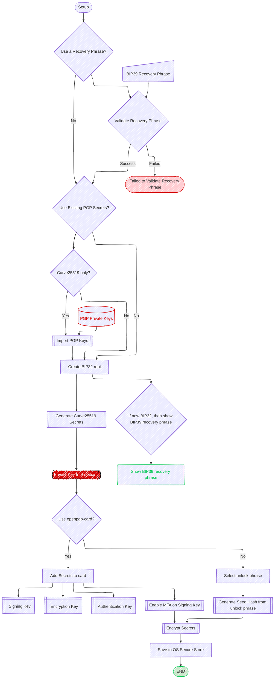
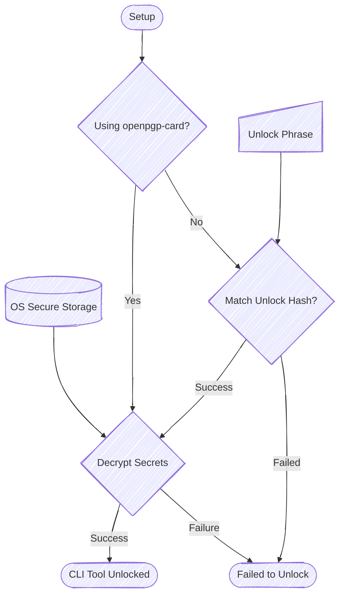
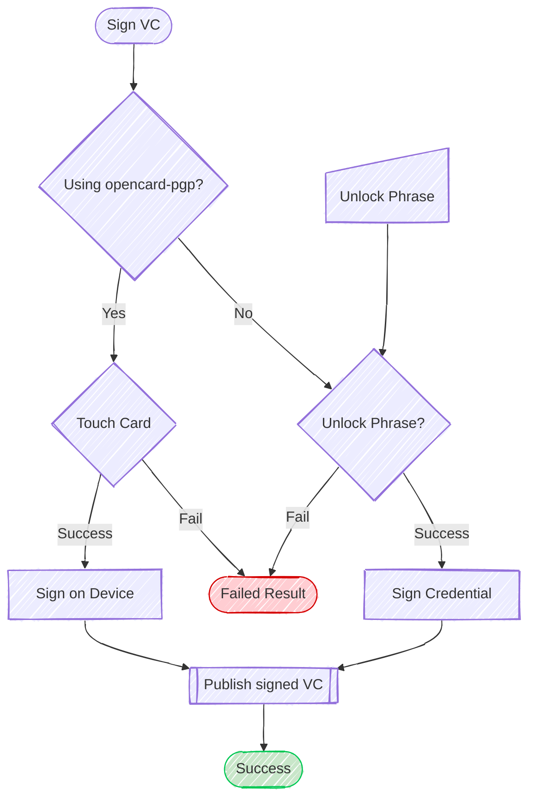

# OpenVTC Secure Key Management Design

The OpenVTC CLI tool requires the use of many secret keys for it to work; at a minimum
the following keys are required:

- **Persona DID**
  - `SIGNING_KEY`: Primary signing key used to sign Verified Credentials (VCs) and
    Verifiable Presentations (VPs).
  - `AUTHENTICATION_KEY`: Proof of ownership of the private key associated with
    this public key.
    - This key is used to identify this account. Can be used for SSH access,
      challenge/response services, etc.
  - `ENCRYPTION_KEY`: Used to encrypt/decrypt data.

- **DID Management (WebVH Management Keys)**
  - N x pre-rolled LogEntry update keys (where N = # of keys defined in WebVH Parameters)
  - Any other key material you wish to place into the DID Document
- **Relationship Credentials**
  - As you create relationships with other entities, a specific relationship DID
    is created for each relationship with it's own separate set of keys

All of the above is linked back to the `Persona DID`.

OpenVTC is designed to be used with physical hardware tokens, such as those made by Nitrokey or Yubikey.

These tokens **MUST** support the openpgp-card protocol.

## Derivation Paths

| Path          | Description                                    |
| ------------- | ---------------------------------------------- |
| `m/0'/0'/`    | Reserved for OpenVTC management keys               |
| `m/1'/0'/`    | Reserved for Persona DID Keys                  |
| `m/2'/1'/`    | Reserved for Persona DID WebVH Management keys |
| `m/3'/1'/1'/` | Reserved for Relationship DID keys             |

## Initial `Public Identity` Secure Key Setup

### Starting Key Space mapping

OpenVTC derives key paths from a BIP32 root. Common starting key paths are:

- Persona DID Path `m/1'/0'/`
  - `m/1'/0'/0'` :: Persona DID Signing Key
  - `m/1'/0'/1'` :: Persona DID Authentication Key
  - `m/1'/0'/2'` :: Persona DID Encryption Key

- WebVH DID Management Path `m/2'/1'`
  - `m/2'/1'/<n>'` :: Pre-rolled update keys for WebVH LogEntries

## CLI Tool unlock

Whenever the CLI tool executes, it needs to unlock the secret key material so it
can use DIDComm to interact with other services.

### Configuration management

There are three configuration stores for the OpenVTC CLI tool:

1. SecuredConfig :: OS Secure Storage (Key material)
2. PrivateConfig :: Encrypted sensitive configuration (relationships and DID contacts,
   etc.)
   - Uses `m/0'/0'/0'` as the derived key for the encryption of PrivateConfig
3. PublicConfig :: Non-sensitive configuration, contains the encrypted PrivateConfig

## Signing Verifiable Credential

Whenever the CLI tool needs to create and sign a verifiable credential, it must
use the `SIGNING_KEY`.

If you are using a hardware token, it is **_STRONGLY_** recommended to enable MFA
(e.g., touch activation) on the signing key.

## Relationship DID Key Management

When you create a relationship with another entity, a new DID may be created.

A relationship DID is a DID:PEER with two keys:

1. Verification Key (Ed25519)
2. Encryption Key (X25519)

The key path for relationship DIDs is:

- `m/3'/1'/1'/N` :: Relationship DID key space

This allows for some flexibility in the future if the derivation paths need to be
changed.
